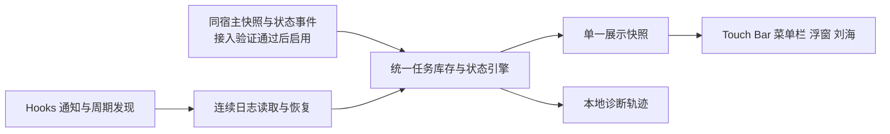

# 任务状态可靠性改造方案

2026 年 10 月 8 日。范围：本机 Codex 独立主聊天的任务状态与数量。本文是待实施方案，未修改、安装或发布应用。

目标是让正在执行的独立任务持续计入，完成或取消后及时退出，HUD 升级、重启和唤醒后能够恢复。验收同时检查漏计与误报，并逐个比较任务身份；测试通过数量不能代替实际正确性。

推荐统一状态引擎，修复日志读取与恢复机制，并用生产运行轨迹验收。与侧边栏完全一致的实时计数，需要同一桌面宿主的权威状态源；当前本机尚不具备外部接入条件，不能把这项能力当作已实现。此次改造可以消除已复现的丢状态缺陷，但纯日志方案不能保证识别所有静默、崩溃和等待用户的情况。

## 已确认的问题

| 证据 | 结论与范围 |
| --- | --- |
| 本机正式安装 0.1.40 Build 43；HUD 显示 1，本地至少两个主会话持续追加当前轮次活动 | 已确认存在主任务数量不一致，尚未逐项核齐用户全部侧边栏任务 |
| 本机一个运行中主会话于 16:26:28 写入约 489 KB 的单条工具结果 | 超过生产读取器的 256 KiB 阈值 |
| 用户指定聊天“修复英特尔 Mac Touch Bar 状态展示”中，报告第 9 秒增加 601,826 字节；用户观察到数字 1 出现后消失，任务继续运行 | 与本机同类机制吻合；旧脚本没有记录 HUD 内存，不能声称已闭环确认 Intel 实机全部根因 |
| 使用现有生产 TaskLogCursor 隔离复现：start 后 1，大增量后 0，后续同轮工具活动仍为 0 | 状态清空与无法恢复属于确定代码缺陷 |
| 旧测试允许恢复后运行数为 0，离线完整回放绕过生产 read 的跳读分支 | 既有通过结果没有覆盖用户要求的连续计数契约 |

代码问题集中在以下链路：

- `Sources/TaskStatusMonitor.swift:37–47`：超过预算跳到末尾，清除 phase、turn 和证据时间；`:99–100` 对超大未完成行也会清 phase。
- `Sources/TaskStatusMonitor.swift:191,276`：每次发现用最近 32 个主任务替换库存，运行中任务可能被挤出。
- `HookCore/TaskEvidenceResolver.swift:126–145`：首次身份头仅读 8 KiB，增量超限同样跳读并请求状态失效。头部、巨行与普通分块需要统一处理。
- `HookCore/TaskStateReducer.swift:176–187` 与 `TaskLifecyclePolicy.swift:24–31`：恢复降为未知，弱事件不能重新激活；前者缺少重新核对通道，后者的防误报保护必须保留。
- 普通日志与 Hooks 仅共享部分策略，读取、恢复、库存和计数仍分叉；等待审批、等待输入等宿主状态没有完整映射。

## 计数与正确性契约

一个本机独立主聊天最多计一次。不同目录、不同 worktree、后台执行的主聊天同样纳入；子代理不额外增加主计数。以宿主身份和 thread ID 去重，以 turn ID 区分轮次，不能只靠标题、更新时间或来源字符串判断是否是侧边栏任务。

内部状态至少区分执行、等待用户、等待审批、结束、失败、中断和待核对。只有已验证的数据源才能提供相应状态；没有等待状态证据时保持待核对，不能猜测。对外运行数与等待数的映射需要以实际宿主版本的行为验证后固定，不能把所有 active 标记机械解释成正在生成。

必须成立的规则：

1. 日志变大、轮询延迟、读取预算用尽，不得单独清除已知生命周期。
2. 迟到工具结果、Token 更新、旧轮次事件不能复活已经结束的任务，也不能覆盖较新的轮次。
3. HUD 重启后自行恢复读取和库存；当前任务数量的恢复按下述能力层级验收。有同宿主状态源时，不要求用户再发起一轮任务。
4. 未出现在一页查询、读取失败、连接断开、30 分钟静默，均不等于任务完成或确认零任务。
5. 相同有序事件无论按何种大小分块，在相同已处理位置得到相同状态。
6. 每个独立聊天恰好计一次；验收先比较身份集合，再比较总数。
7. 完整性、数据时效与任务状态分别记录。覆盖缺口恢复后能够解除，历史故障不能永久污染当前健康状态。

## 状态来源与接入条件

官方协议提供 `thread/read`、带 runtime status 的 `thread/list`、`thread/loaded/list` 和 `thread/status/changed`。这些能力必须以实际连接的宿主实例为边界。`thread/read` 不订阅事件；`thread/list` 默认可能扫描并修复日志元数据，纯查询使用支持版本中的 `useStateDbOnly`。参考 [Codex App Server](https://learn.chatgpt.com/docs/app-server)。

本轮只读核验发现：桌面宿主 PID 2973 为独立 app-server，默认使用 stdio；未发现可命名 Unix 监听端点或 TCP 监听。HUD PID 3202 的子进程 PID 3242 是另一个 stdio app-server。默认 daemon 控制 socket 不存在。PID 是此次现场证据，不是后续实现的固定值。

因此实施分为两个能力层级：

| 层级 | 条件 | 可承诺的结果 |
| --- | --- | --- |
| 连续日志监测 | 完成本文统一引擎、恢复、库存和实机验收 | 已覆盖日志中的生命周期不会因为调度预算丢失；已知漏计与误报用例通过；仍有日志无法判定的状态边界 |
| 宿主状态同步 | 获得受支持的同宿主只读快照和状态更新通道，并验证覆盖所有目标主聊天 | 在明确版本、范围及延迟指标内与宿主逐任务一致，静默与等待状态以宿主为准 |

不能将新启动 app-server 的 loaded/list、另一个服务的 notLoaded，或本次 Codex 内置工具权限当成分发 App 可用的全局接口。不能通过 resume 用户任务来制造监测订阅。

后续宿主通道的准入检查必须证明：宿主实例一致、枚举分页完整、空闲与未加载语义明确、事件覆盖新聊天、断线可补偿、只读访问不会改变任务执行。通道不可用时，继续完成连续日志监测，但不将其标为全量精确模式。

## 统一引擎

保留一个任务库存、一个状态转换器和一份展示快照。快照、日志、Hooks 均只提供带来源的观察记录；任何来源都不能单独维护一套最终计数。Hooks 用于加快发现与核对，不直接等同开始或成功结束。

状态引擎接收经过验证的 thread、turn、宿主代次、文件代次、事件顺序和观察时刻。连接重建后旧回调不得更新新代次。当前权威快照优先于旧日志；不同来源没有可比较顺序时先重新核对，不能简单按本机接收时间覆盖。

宿主适配器不得假定协议存在全局递增序号。若实际接口没有一致性水位，使用串行对账轮次、事件暂存和补查构成验证过的收敛流程；不能把多页非原子列表称为某个时刻的精确快照。

## 连续读取与积压处理

256 KiB 改为一次调度的读取配额。每次从上次已提交位置继续，配额耗尽后保存积压并再次调度；绝不直接跳到文件尾。总 I/O、内存和每轮运行时间有上限，多个任务公平轮转，单个大输出不能阻塞其他任务。

读取位置和完成解码位置分开。大 JSON 行使用流式解析，仅提取经过类型校验的生命周期字段，跳过正文值而非整条记录；`task_complete` 本身也可能携带很大的正文，不能无条件忽略超大行。解析必须处理转义、嵌套、UTF-8 跨块、半行以及字段顺序，正文内出现类似事件字符串不得触发生命周期。

积压期间保留最后已知状态并标记内部时效，不逐条回放历史闪烁或完成提示。追到本次捕获的文件末尾后再发布当前核对结果；对于持续大流量，记录同步延迟并启动恢复策略，不能无限展示旧数而声称实时。解析失败必须定位到任务和文件代次，不能清空全部库存。

新任务发现使用分页和稳定分页键。运行中及待核对任务不因跌出最新一页而移除；32 是每轮工作量，不是总任务数。低频完整对账补偿漏失的 watcher 和 Hook，按需监听不足时轮询补位。完整遍历结束前不宣称库存覆盖完整。

## 重启和升级恢复

将最小状态快照、已处理位置、文件身份与代次、轮次顺序和完成去重标记原子保存。数据只包含必要元数据，不另存提示词、回复或工具正文。只在完整记录边界提交断点；崩溃后可重读尚未提交片段，通过幂等处理消除重复。

恢复时验证文件身份、长度与边界锚点，防止轮转、截断或原地改写被误当连续追加。校验失败则重建该任务证据链。既有非终态作为最后已知状态等待核对，不能无条件显示为当前运行，也不能永远丢弃。

同宿主状态可用时，快照直接核对当前任务。仅日志可用时，从有效断点补齐；初次安装或断点失效时，分批构建可审计的生命周期索引，恢复生命周期历史与最后已知状态。历史 start 加上工具或 Token 活动，不足以把待核对升级为已确认的当前执行；更不能复活曾确认结束的轮次。当前执行须有本观察代次的明确 start，或通过准入验证的同宿主当前状态确认。近期文件修改或宿主进程存活也不能代替该证据。日志没有终态而宿主已崩溃的情况保持待核对。

完成提示与状态恢复分开：启动、升级和补读旧历史不重播完成；当前观察期中新确认的完成才进入现有约 4 秒反馈，并进行去重。

## 展示与诊断

保留用户此前确认的普通模式约定：不自动增加问号、错误行或诊断 tooltip；四个展示端消费同一快照。`9+` 等现有宽度压缩可以保留，但不能各自计算不同数字。

当前“已确认执行中 N”属于证据计数。只有覆盖和时效都验证通过时，才能宣称是目标范围的全部运行数。连接故障或未知不能转换为精确 0；确需改变降级时的主界面表达，应单独审阅具体效果，不借可靠性改造擅自改变外观规则。

接入现有内置诊断建设，从生产读取器、状态引擎、协调层和实际展示处记录同一条轨迹，禁止另写一个推算器代替生产状态。每次数字变化记录匿名任务别名、前后状态、原因、宿主与连接代次、已处理位置、积压、覆盖和展示快照编号；字段采用白名单。不记录正文、标题、原始路径、账号数据或用量。诊断默认只保存在本机。

必须能够回答一次 3→1 的变化具体是哪两个任务退出、什么证据触发，以及屏幕收到的是哪份快照。

## 验收与发布条件

下列数值是拟定的验收目标，不是本轮已完成结果。

| 场景 | 必须通过的检查 |
| --- | --- |
| 独立任务并发 | 真实 1、3、8 个主聊天逐项对照；合成 33、65 个候选，运行中任务不能被挤出；子代理不能重复计数 |
| 日志突增 | 256 KiB 临界前后、489 KB、601,826 字节、2 MiB、16 MiB；分别覆盖巨行和多行，读完后身份集合完全一致 |
| 分块不变量 | 1 字节到大块读取，UTF-8、转义、嵌套、大头部与大 terminal；同一处理位置结果相同，正文伪事件不生效 |
| 已修误报 | 结束后迟到工具、旧 turn、重复和乱序事件、缺失 turn ID，不得重新激活或产生假完成 |
| 恢复 | 覆盖任务中启动 HUD、只重启 HUD、升级且 Codex 不退出、睡眠唤醒、断连和崩溃；日志模式自行恢复断点、库存及连续读取，当前无法确认的状态保留待核对；宿主同步模式还须恢复当前身份集合和数量，无需新一轮任务或重启 Codex |
| 长任务及等待 | 超过 30 分钟静默、等待审批与输入、失败、中断和续跑；按已验证来源区分，不因静默推定结束 |
| 存储异常 | 数据库忙、索引延迟、文件失败、轮转截断、缓存损坏、新来源或未知 schema；隔离影响并在恢复后自行收敛 |
| 完整展示 | 同一快照贯穿 monitor、coordinator、四个 UI；核验实际 PID、安装路径、架构与产物哈希 |
| 性能及隐私 | 大输出公平调度、取消、有限内存、无主线程 I/O；诊断白名单；对比旧版空闲与负载表现 |
| 真实故障机 | arm64 本机，以及 Intel macOS 15.8.1 与报告中的宿主版本；重做“升级后新任务出现 1 又消失”流程 |

普通负载目标：已发现任务状态变化 2 秒内收敛，新任务 10 秒内发现。事件源具备更快能力后另行收紧。巨型日志压力必须另报最大积压和最大延迟，不能用平均值掩盖长期漏计。

自动化测试必须使用生产 read、调度、恢复和展示链路。正确性真值来自独立输入清单，不来自同一套解析器的第二份实现。受控回放的每个稳定检查点要求身份集合零误报、零漏报；实际并发与恢复连续重复至少 20 轮，再进行一工作日对照试用。

arm64 与 x86_64 必须验证同一源码版本和实际分发产物。双架构编译通过不替代实体 Intel 故障机验收。未取得同宿主权威状态时，不在发布说明中承诺所有侧边栏任务全量精确。

## 实施顺序

1. 固定上述契约与证据用例。先让当前版本在大增量、恢复和第 33 个任务场景稳定失败；核验宿主接入条件，不以不可用接口阻塞已知缺陷修复。
2. 在隔离工作区实现统一流式读取器、库存和恢复，Legacy 与 Hooks 改为接入适配器。保留额度与现有 UI 行为，兼容当前 macOS 最低版本。
3. 接入生产诊断与同一快照展示。与现有诊断开发工作树协调集成，避免再建第二套诊断存储和任务推算逻辑。
4. 用独立试用 App 执行完整验收；新旧引擎可短期只读对照，结束后移除重复运行，避免长期双倍 I/O。
5. 取得本机与 Intel 故障机证据后再准备正式安装或发布。宿主状态通道将来通过准入检查后接入同一引擎，不再改写各端的计数逻辑。

任何一步未通过，都按实际失败保留证据；不得通过修改断言，把仍在运行任务归零重新定义为成功。

## 依据

- [用户指定的 Intel 排查聊天](codex://threads/01a11a23-e56d-7831-b4b0-83d994a50b3a)
- [前次生命周期验证及未完成边界](TASK-LIFECYCLE-VALIDATION.md)
- [普通模式已确认的展示约定](TASK-COMPLETION-STATE-FIX.md)
- [外部诊断脚本的采集边界](TASK-STATUS-DIAGNOSTICS.md)
- [现有内置诊断实施方案](DIAGNOSTICS-IMPLEMENTATION-PLAN-2026-10-08.md)
- [现有升级诊断连续性方案](DIAGNOSTICS-UPGRADE-CONTINUITY-PLAN-2026-10-08.md)
- [官方 App Server 协议](https://learn.chatgpt.com/docs/app-server)
