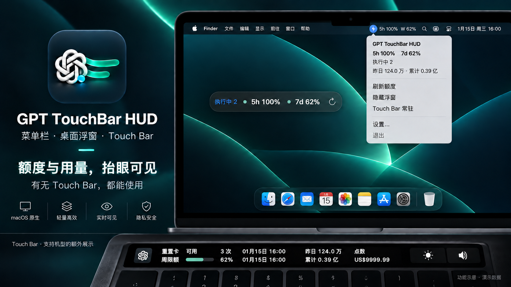
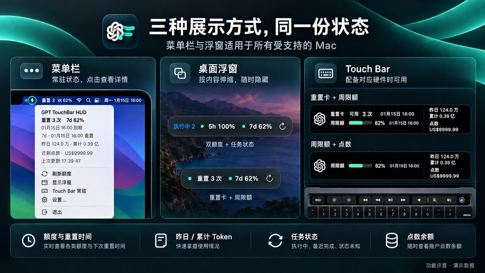
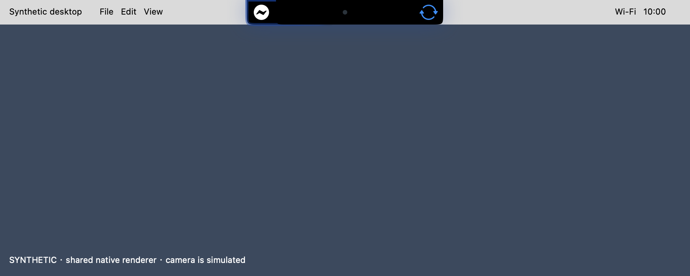
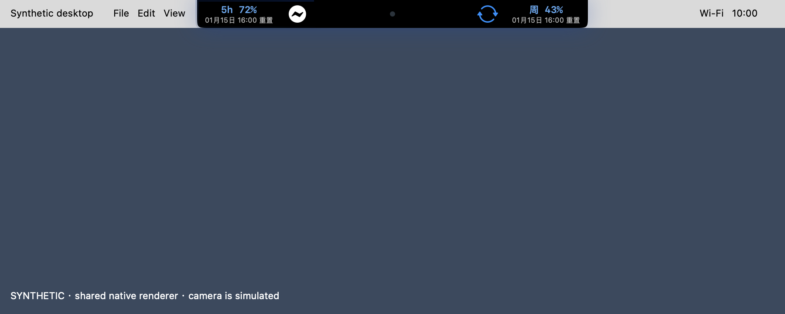
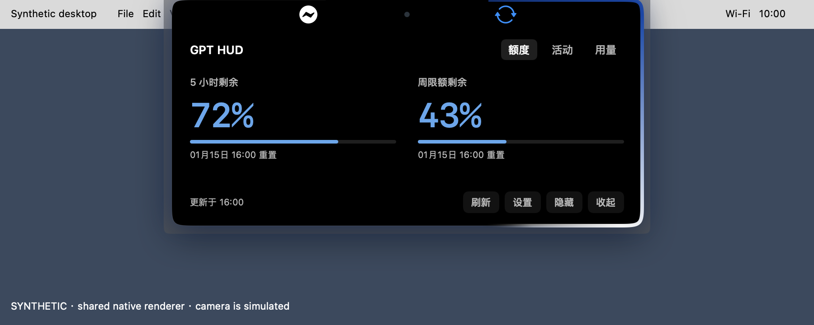

# GPT TouchBar HUD

在 Mac 菜单栏、刘海融合面板和可选桌面浮窗中随时查看 ChatGPT / Codex 的额度、Token 用量与任务状态。应用以菜单栏配件运行，不在 Dock 常驻；支持有或没有 Touch Bar 的 Mac，配备 Touch Bar 的机型还可使用跨 App 常驻额度条。



整体配图为功能与设备场景示意，使用演示数据；实际字形、间距及控件以原生界面为准。本文按当前源码说明，正式安装包可能尚未包含最新界面，体验当前效果可[从源码构建](#从源码构建)。当前正式版是 [v0.1.29 / Build 32](Documentation/RELEASE-0.1.29.md)：它已包含 Compact / Peek / Expanded 三态能力，但通用设置仍使用“刘海始终显示额度”复选框；当前源码将同一偏好改为“刘海常驻形态”两项菜单，并将未设置时的默认形态改为 Peek，旧选择会保留。

## 这是什么

GPT TouchBar HUD 是一个轻量 macOS 额度与用量状态工具，无需 Touch Bar 硬件。它作为菜单栏配件运行，通过 ChatGPT / Codex 自带的本机 `codex app-server` 读取账号数据，把以下信息整理成随时可见的状态：

- 5 小时额度、周额度及各自的重置时间。
- 可用完整重置次数及最早到期日期。
- 额度点数余额。
- GPT 账号昨日 Token 和累计 Token。
- 本机 Codex 任务的执行中、最近完成和状态未知提示（实验性）。

日常使用从菜单栏开始：按设置显示状态图标或额度，点击展开用量和状态详情。配备有效刘海区域的屏幕可使用顶部融合面板，其他屏幕可按需打开桌面浮窗；可通过菜单显示或隐藏当前面板。配备 Touch Bar 的机型还会默认在左侧应用区域显示额度条。

它适合希望在工作过程中快速确认剩余额度、不想频繁打开账号页面，也不希望额外配置 API Key 的 ChatGPT / Codex 用户。

## 主要功能

| 功能 | 说明 |
| --- | --- |
| 菜单栏状态 | 横向闪电图标常驻并随任务状态变色；按设置显示图标、一项额度或完整额度，点击后先查看状态汇总，再执行操作。 |
| 自适应 HUD | 未设置模式时自动识别刘海屏；刘海面板提供 Compact、Peek、Expanded 三态，无刘海时回退桌面浮窗。手动模式和显示/隐藏选择会保存。 |
| 多种额度展示 | 根据接口实际返回显示 5 小时额度、周额度、重置次数、到期时间和点数余额，不重复伪造不存在的额度窗口。 |
| 账号 Token 统计 | 显示 GPT 账号“昨日”和“累计”Token，使用服务端账号口径，不再扫描本地会话日志作为主数据。 |
| 任务状态提示（实验性） | 菜单栏图标和桌面 HUD 提示执行中、最近完成或状态未知；有 Touch Bar 时同步显示图标角标，可随时关闭。 |
| 独立设置窗口 | 分为通用、外观、Touch Bar、实验和更新；调整显示形式、刘海常驻形态、菜单栏内容、语言、任务提示、外观、Touch Bar 常驻与自动检查更新。 |
| 自动联动宿主 | 首次运行后注册 LaunchAgent；ChatGPT / Codex 启动时自动运行，宿主完全退出后自动结束。 |
| 刷新与容错 | 额度定时刷新；短暂失败时保留上次数据，Token 旧数据用 `*` 标记，缺失数据用 `--` 显示。 |
| 自动检查更新 | 正式安装后默认按需检查最新正式版本；后台只做轻量提醒，下载安装仍须用户主动确认并通过完整校验。 |
| 本地登录态 | 不要求填写 API Key，不抓取网页，不保存密码、授权码或访问令牌。 |
| Touch Bar 常驻（需对应硬件） | 默认在左侧应用区域显示完整额度条，切换到其他 App 后仍可见；可在设置中关闭。 |
| 系统控制条共存（需 Touch Bar） | 右侧继续使用 macOS 原有的亮度、音量等控制项；控制条展开时隐藏 Token，收起后恢复。 |

## 当前显示效果

菜单栏用于随时查看主要额度并展开详情；刘海融合面板和桌面浮窗用于按需留意任务与剩余额度，两者均可隐藏。配备 Touch Bar 的机型还可在键盘上方常驻显示额度、用量与点数。



- **菜单栏**：横向闪电图标随任务状态变色，支持额度及重置卡外显，点击后查看完整摘要和操作。
- **桌面浮窗**：单行显示任务与额度，随内容自动伸缩；只保留刷新按钮，从菜单中隐藏。
- **刘海融合**：Compact 静止态显示两侧指示器，悬停进入 Peek 额度预览，点击进入 Expanded 详情；未设置模式时按屏幕自动适配。
- **Touch Bar**：白色粗体、日期对齐、紧凑双行布局；点数有值时追加，保留额度进度条。仅在配备对应硬件时使用。

<details>
<summary>查看当前原生界面细节</summary>

以下图片由当前 AppKit 视图渲染，使用演示数据，供核对实际排版；不是完整桌面或实体 Touch Bar 照片。

**桌面浮窗：任务状态 + 双额度**


**菜单顶部摘要：额度、日期、用量与点数**


**Touch Bar：重置卡 + 周限额 + 点数**


**Touch Bar：仅周限额 + 点数**


</details>

## 工作原理

```text
ChatGPT / Codex 本机登录态             本机 Codex 任务
              │                         ├─ 任务索引与近期日志（默认）
              ▼                         └─ 已审阅并启用的 Hooks（可选）
       codex app-server                           │
              │                                   │
   ┌──────────┴──────────┐                        │
   │                     │                        │
account/rateLimits/read  account/usage/read       │
   │                     │                        │
   └──────────┬──────────┘                        │
              └────────────────┬──────────────────┘
                               ▼
                       GPT TouchBar HUD
                        ├─ macOS 菜单栏
                        ├─ 刘海融合面板（可用时）
                        ├─ 桌面 HUD（可选）
                        └─ Touch Bar（有对应硬件时）
```

应用会依次查找以下本机程序：

```text
/Applications/ChatGPT.app/Contents/Resources/codex
/Applications/Codex.app/Contents/Resources/codex
/Applications/GPT.app/Contents/Resources/codex
```

找到后以子进程方式启动 `codex app-server --listen stdio://`，通过 JSON-RPC 读取额度和账号 Token 数据。应用本身不直接处理登录凭据。任务状态默认来自有界的本机索引与近期日志读取；Hooks 实验默认关闭，启用后用于触发状态核对，仍会有界读取本机任务索引与日志。只有用户审阅计划并明确应用后才写入配置和安装稳定 helper。

## 快速开始

### 1. 环境要求

- macOS 11 Big Sur 或更新版本。
- 已将 ChatGPT、Codex 或 GPT 安装在系统 `/Applications` 目录。
- 已在宿主应用中登录，并且其本机 `codex app-server` 可用。

| Mac | 安装包 | 可用界面 |
| --- | --- | --- |
| Apple Silicon（M1 / M2 / M3 / M4 等） | 文件名以 `arm64.dmg` 结尾 | 菜单栏、HUD；有 Touch Bar 时可额外显示额度条 |
| Intel Mac | 文件名以 `x86_64.dmg` 结尾 | 菜单栏、HUD；有 Touch Bar 时可额外显示额度条 |
| 没有 Touch Bar 的 Mac | 选择与处理器一致的 DMG | 菜单栏、HUD |

### 2. 下载安装

1. 打开当前仓库的 [Releases](https://github.com/zz-zed/GPT-TouchBar-hud/releases) 页面。
2. 根据 Mac 处理器下载 `GPT-TouchBar-HUD-<版本号>-arm64.dmg` 或 `GPT-TouchBar-HUD-<版本号>-x86_64.dmg`。
3. 打开 DMG，把 `GPT TouchBar HUD.app` 拖入 `Applications`。
4. 先启动并登录 ChatGPT / Codex，再打开 `GPT TouchBar HUD.app`。

首次打开提示“无法验证开发者”时：

- 双击安装包中的 `首次打开助手.command`，输入 `OPEN`，按回车。
- 若助手也打不开：先尝试打开应用，再进入 **系统设置 → 隐私与安全性 → 仍要打开**，确认打开。

应用未经 Apple 公证，仅对你信任的安装包操作，无需开启“任何来源”。若提示恶意软件或应用损坏，请停止并重新下载或联系维护者。

### 3. 首次运行

首次从 `Applications` 启动后，应用会：

- 在菜单栏显示额度状态。
- 配备 Touch Bar 的机型默认启用额度条常驻。
- 未设置显示模式时自动识别刘海屏；有刘海且未设置显示状态时直接显示刘海面板，无刘海时桌面 HUD 默认隐藏。已有手动设置优先。
- 注册当前用户的 LaunchAgent：

```text
~/Library/LaunchAgents/io.github.zz-zed.GPTTouchBarHUD.CodexLauncher.plist
```

之后 ChatGPT / Codex 启动时，LaunchAgent 会自动打开额度工具。若你在宿主仍运行时手动退出，本轮宿主会话内不会再次自动拉起；宿主完全退出后会解除这次手动退出状态。

从旧版升级时，新应用会迁移原有的 HUD 外观与 Touch Bar 常驻设置，停用旧 LaunchAgent，并兼容旧版的手动退出状态，避免两个版本同时自动启动。

## 日常使用

### 版本与更新

菜单栏下拉菜单显示当前版本及构建号，保留 `检查更新…`；“设置 → 更新”可关闭或重新开启自动检查。

- 自动检查默认开启，仅在 App 安装于 `/Applications/GPT TouchBar HUD.app` 或 `~/Applications/GPT TouchBar HUD.app` 且应用标识正确时运行。启动后至少等待约 30 秒，到期才检查；成功后 24 小时内不重复请求，睡眠唤醒只补一次到期检查。开发 worktree、DMG、SwiftPM/`swiftc` 测试和刘海模拟入口不会自动联网。
- 优先使用 GitHub Release API；普通读取失败时回退到 GitHub 最新 Release 页面，遇到服务端限流则按 `Retry-After` 或限流重置时间等待。只接受本仓库最新正式版，不安装草稿、预发布版或降级版本。
- 后台无更新或失败不会弹窗。发现新版本只在菜单和设置显示入口，不抢焦点、不自动展开刘海、不下载或安装。失败按有限退避重试，最近尝试、最近成功、可用版本、跳过版本和重试期限会跨重启保存。
- 用户主动查看版本说明后，可选择 `安装并重启`、`稍后` 或 `跳过此版本`。手动检查始终可用，也能重新找到已跳过版本；手动与后台并发时共享一次请求。
- 只有点击 `安装并重启` 才会下载、校验和安装。安装完成后重启额度工具，不退出 ChatGPT；下载或安装期间不重复检查。
- 按当前程序架构选择安装包，核对 SHA-256、包大小、应用标识、版本、最低 macOS 要求及代码签名完整性。缺少安装包或 `SHA256SUMS.txt` 时拒绝安装。
- 原地更新仅支持可写的 `/Applications/GPT TouchBar HUD.app` 或 `~/Applications/GPT TouchBar HUD.app`。开发 worktree、DMG 和其他目录不被覆盖，可打开 Release 页面手动安装；不会请求管理员权限。
- 安装前保留旧应用；文件替换失败或系统拒绝启动时尝试恢复。成功启动请求不代表已验证新版运行健康。备份及日志保留在应用同级隐藏目录 `.GPTTouchBarHUD-update-<随机标识>/`，其中 `previous.app` 可用于手动恢复；不会自动删除备份。

当前发布使用 ad-hoc 签名，SHA-256 与安装包来自同一个 GitHub Release，校验用于发现损坏，不等同于独立发布者签名或 Apple 公证。更新信任本仓库及 GitHub HTTPS 分发；后续可升级为独立签名的更新源。

### 任务状态（实验性）

在 `设置… → 通用` 中，`显示任务状态（实验性）` 开关控制任务指示器，默认开启。以下描述默认日志模式；可选 Hooks 模式见下文：

- 菜单栏常驻横向闪电圆形图标：执行中为蓝色、最近完成为绿色、未知为灰色，空闲或关闭任务提示时使用系统中性色；旁边的额度文字不随图标变色。

- Touch Bar 的 ChatGPT 图标右下角显示角标：蓝色数字为执行中的任务数，绿色 `✓` 为最近一轮完成，灰色 `?` 为状态未知。不占用额度与 Token 文字区域。
- 执行中的蓝色角标带有轻微呼吸动画；任务结束或 Touch Bar 项目隐藏时停止。开启系统“减少动态效果”后保持静态，空闲时恢复原图标。
- 手动打开浮窗后，左侧显示同一份状态摘要；任务变化不会自动弹出浮窗。
- 执行中优先展示；本轮完成保留 30 秒，到期后该任务进入空闲。明确中止的任务也进入空闲，不显示完成提示。全部任务空闲时隐藏角标和浮窗状态摘要，恢复原有布局；仍有状态未知的任务时保留 `?`。为兼容长时间运行且没有中间日志的命令，执行中的任务连续 30 分钟没有新事件后才降级为未知，避免过早漏计，同时限制遗留状态长期误报。

默认日志模式仅依据本机 Codex 最近 32 个未归档任务的本地日志推断，不代表所有 ChatGPT 网页、远程任务或账号任务。首次发现时，仅最近 30 分钟有日志更新的任务参与指示；更早的历史记录不影响当前展示，这不代表已确认历史任务结束。监测期间有新增日志的任务会继续参与状态判断。新增任务通常在 10 秒内被发现，已发现任务每 2 秒检查新增日志；单个文件每次最多读取 256 KiB。参与监测的日志格式不兼容、事件缺失或读取失败时显示未知，不影响额度读取。

“本轮完成”不等于整个目标完成；第一版不识别等待审批、等待输入或失败，也不提供进度百分比。长时间无日志的工具执行可能显示未知。该功能依赖未公开承诺稳定的本地记录格式，宿主升级后可能需要适配。可随时关闭开关，停止任务日志读取。

### Hooks 任务监测（默认关闭）

在“设置 → 实验”打开 Hooks 配置，审阅计划后才可应用；仅打开窗口不会启用监测或写入配置。启用需宿主正常信任，新建或变更的 Hook 可能需要重新信任和重新打开任务。额度与 Token 数据来源不变。

Hooks 模式分别显示执行中、已提交待核对、未知、覆盖范围和连接健康；覆盖不完整时保留 `?` 和原因，不把连接正常当作全量覆盖或精确零任务。新完成事件的提示约 4 秒后消失，刷新和隐藏重开不重播，同轮继续执行会撤销完成提示。日志模式的 30 秒最近完成规则保持不变。

真实宿主执行、任务准确性、延迟和长期能耗尚未验收，没有省电收益结论。关闭实验会恢复日志模式；已应用的配置与稳定 helper 通过独立清理流程处理，删除 App 不会自动移除它们。具体口径、配置审阅和清理边界见 [Hooks 实验说明](Documentation/HOOKS-EXPERIMENT.md)。

### 菜单栏

菜单栏标题优先显示：

```text
5h 85%  W 80%
```

如果账号没有 5 小时窗口但提供完整重置次数，则显示类似：

```text
重置3  W 96%
```

菜单栏内容可选“自动 / 仅图标 / 单额度 / 完整额度”。自动模式会在刘海面板或桌面 HUD 显示时只保留状态图标，面板隐藏后显示一项主要额度；手动选择的仅图标、单额度或完整额度不会随面板可见性切换。

点击菜单栏后，顶部先汇总额度、任务状态、重置或到期时间、昨日/累计 Token、点数和更新时间；下方提供操作：

| 菜单项 | 用途 |
| --- | --- |
| 刷新额度 | 立即刷新额度，并在防抖允许时刷新 Token 统计；刷新中禁用重复点击。 |
| 显示状态面板 / 隐藏状态面板 | 按当前显示形式打开或隐藏状态面板；隐藏状态独立保存。 |
| 收起详情 | 返回所选刘海常驻形态；Compact 悬停展示额度，Peek 常驻展示额度。 |
| 显示形式 | 选择自动、刘海融合或桌面浮窗；无有效刘海区域时回退桌面浮窗。 |
| 菜单栏内容 | 选择自动、仅图标、单额度或完整额度。 |
| Touch Bar 常驻 | 开启或关闭跨 App 常驻。 |
| 设置… | 打开独立设置窗口，也可使用 `⌘,`。 |
| 新版本提醒 / 检查更新… | 查看当前版本和构建号、打开后台发现的新版本，或手动查询最新正式版。 |
| 退出 | 结束应用，并在当前宿主会话内阻止自动重新拉起。 |

### 设置

| 分页 | 设置内容 |
| --- | --- |
| 通用 | 选择显示形式、显示/隐藏状态、刘海常驻形态、菜单栏内容和中文 / English，并开启或关闭任务状态提示。语言影响额度与任务信息，导航和设置保持中文。 |
| 外观 | 选择浮窗颜色，分别调整背景和文字不透明度；下方实时预览，修改即时保存。数值越高越不透明。 |
| Touch Bar | 控制常驻；系统接口不可用时禁用开关并说明原因。 |
| 实验 | 进入默认关闭的 Hooks 配置审阅与应用流程。 |
| 更新 | 开启或关闭自动检查，查看最近成功状态、新版本提醒并手动检查。 |

中文用量采用“万/亿”，英文采用 K/M/B/T 单位；重置卡到期时间均精确到分钟。升级时保留已有外观偏好。

当前源码的“刘海常驻形态”提供“静止态 Compact”和“额度预览态 Peek（默认）”；Compact 在悬停时展示额度，Peek 在静止时也保留额度。v0.1.29 正式安装包使用“刘海始终显示额度”复选框表达同一选择：关闭对应 Compact，开启对应 Peek。两种界面复用同一个布尔偏好；已有选择继续保留，只有从未保存过该偏好时才默认 Peek。

### 桌面 HUD

Quiet HUD 需要从菜单栏手动显示，以单行胶囊呈现任务和额度，宽度随可见内容自动伸缩：

```text
执行中 2   ● 5h 85%   ● 7d 80%   ↻
```

```text
● 重置 3次   ● 7d 96%   ↻
```

- `↻` 刷新数据；刷新中显示等待图标并禁用按钮，失败时显示错误图标和提示。
- 浮窗没有关闭或退出按钮；通过菜单的 `隐藏浮窗` 收起，需要退出应用时使用菜单栏的 `退出`。
- 青绿色、黄色和红色状态点区分充足、中等和较低的剩余额度；重置卡使用青色状态点。
- 鼠标悬停可查看刷新状态或任务详情等提示；重置/到期时间、Token 和点数汇总位于菜单详情。
- 右键菜单提供刷新、隐藏浮窗和设置入口。
- 开启系统“减少透明度”或“提高对比度”后，浮窗使用不透明背景和内容，并增强边框。

### Touch Bar（配备对应硬件时）

默认开启 `设置… → Touch Bar → Touch Bar 常驻`，也可直接在菜单栏下拉菜单中切换：

- 额度条位于左侧应用区域，右侧保留系统控制条。
- 切换到其他 App 后，额度条会重新呈现。
- 展开系统控制条时，Token 展示会被系统覆盖；收起后自动恢复。
- 普通状态不显示额外的关闭按钮，退出应用请使用菜单栏的 `退出`。
- 信息列随内容计算宽度；没有点数时不预留空列，有点数时仍保留额度进度条。
- 中文日期显示到分钟；重置卡日期表示到期时间，额度日期表示重置时间。Touch Bar 中省去“到期/重置”后缀，完整含义可在菜单详情中查看。
- 隐藏 HUD 不影响 Touch Bar 常驻。

关闭 `Touch Bar 常驻` 后，应用会立即释放系统级额度条。此时仍可通过点击已显示的 HUD，使用和当前 App 焦点绑定的普通 Touch Bar 模式。

常驻模式会占用其他 App 的 Touch Bar 应用区域，因此其他 App 原本放在左侧的快捷按钮会被覆盖。需要使用这些按钮时，可暂时关闭常驻开关。

### 刘海融合（配备对应屏幕时）

未设置显示模式时，软件启动后自动检测可用刘海屏：有刘海则采用刘海融合，无刘海则使用桌面浮窗。首次检测到刘海且尚未保存显示/隐藏选择时，会直接显示面板；已经隐藏的面板保持隐藏。用户在“设置 → 通用 → 显示模式”手动选择“桌面浮窗”或“刘海融合”后，重启及屏幕变化不会覆盖该选择；选择“自动”可恢复自动适配。旧版本已保存的模式继续保留。桌面浮窗颜色与透明度保持独立，刘海面板始终为黑色不透明外观。

面板稳定选择具有有效刘海区域的显示屏，并使用三种明确状态：

- **Compact**：可选静止态，黑色外壳从屏幕顶边延伸到刘海两侧，显示应用与任务指示器；悬停时进入 Peek。
- **Peek**：默认常驻形态，横向展示额度和重置时间。
- **Expanded**：点击后向下展开详情，可切换“额度 / 活动 / 用量”；长内容可滚动，底部提供刷新、设置、隐藏和收起。

离开面板或收起详情后返回所选常驻形态。任务变化不会自动展开面板。

外壳、内容裁剪和点击判断共用实际动画轮廓；摄像头区域、透明角落和外部装饰不接收点击，外部点击可传递给下层窗口。界面适配减少动态效果、降低透明度和低电量设置。刘海宽度与安全区高度取自系统，双翼视觉高度另行校准；这不代表已精确测量硬件圆角或完成真实接缝校准。双翼和展开面板可能占用菜单栏空间，拥挤菜单栏仍需实机验证。

**Compact 原生模拟**



**Peek 原生模拟**



**Expanded 原生模拟**



以上为正式渲染代码生成的演示画面，桌面、摄像头和额度数据均为模拟，不是实体刘海屏照片。

菜单和设置均能恢复隐藏的面板，再次双击正在运行的应用可打开设置。

无有效刘海几何或 macOS 11 时自动回退桌面浮窗，保留原显示形式偏好；接回有效刘海屏后恢复。桌面浮窗显示、内容宽度改变和拖动结束时会校正可用屏幕边界。锁屏/休眠时面板暂时隐藏，恢复后仍尊重用户的可见性设置。Touch Bar 保持独立，没有 Touch Bar 的 Mac 同样支持菜单栏与浮窗。

几何、状态和布局可通过自动化模拟测试。当前原生预览入口为 `bash scripts/test-notch-presentation.sh --preview --debug-regions`，详见[原生刘海面板与验证](Documentation/NotchIsland/README.md)。`scripts/debug-notch-hud.sh` 保留为旧渲染器的调试入口。不同 Mac 型号的实体刘海接缝、透明角落点击穿透、全屏、自动隐藏菜单栏、锁屏/唤醒及多屏切换仍可能受系统版本和硬件布局影响；遇到问题可切换为桌面浮窗。

## 数据说明

| 指标 | 数据来源与口径 |
| --- | --- |
| 5 小时 / 周额度 | `account/rateLimits/read` 返回的额度窗口；按窗口时长识别，不把单个周窗口重复显示成 5 小时额度。 |
| 重置次数 | `rateLimitResetCredits` 中当前可用的完整重置次数及最早到期时间。 |
| 点数余额 | 额度快照中的 `credits.balance`；余额为 0、无限额度或字段缺失时不显示。 |
| 昨日 Token | `account/usage/read` 的昨日每日桶，使用当前系统日历匹配日期。 |
| 累计 Token | `account/usage/read` 返回的账号累计值，不用有限天数的每日桶求和代替。 |

刷新规则：

- 额度通常每 60 秒刷新，也会响应 app-server 的额度更新通知。
- 账号 Token 通常每 5 分钟刷新。
- 手动刷新 Token 的最短间隔为 10 秒，避免连续点击产生过多请求。
- Token 请求失败后按 5、10、20、30 分钟逐步退避；如果有上次成功结果，会继续显示并增加 `*`。
- 缺失或无法确认的数据显示 `--`，不会当成 0。

## 兼容性与已知限制

- Touch Bar 不是必需硬件；无 Touch Bar 的 Mac 仍可使用菜单栏和 HUD。
- 常驻 Touch Bar 使用经过运行时签名检查的 AppKit 私有 system-modal 接口。macOS 的公开 API 只能沿当前 App 的焦点响应链显示 Touch Bar，无法实现跨 App 常驻。
- 私有接口可能在未来 macOS 更新中变化。接口缺失或签名不兼容时，常驻开关会不可用，应用保留普通焦点绑定模式。
- 当前安装包采用 ad-hoc 签名，尚未完成 Apple Developer 签名和公证。
- 账号 Token 日期桶的服务端全局时区规则没有公开承诺；当前实现按本机日历匹配昨日日期。
- 同一邮箱和套餐下的 workspace 切换主要依赖宿主发出的账号变更通知。

## 从源码构建

需要安装 Xcode Command Line Tools 和支持 Swift 5.8 的工具链。

```bash
git clone https://github.com/zz-zed/GPT-TouchBar-hud.git
cd GPT-TouchBar-hud
scripts/build-app.sh
open "build/GPT TouchBar HUD.app"
```

`scripts/build-app.sh` 使用显式 SDK 和 `Resources/Info.plist` 中的最低系统目标，通过 `swiftc` 优化编译并链接主程序与原生 helper，然后分别签名和验证。默认构建本机架构；只有工具链具备对应兼容库时，才可用 `HUD_BUILD_ARCHS='arm64 x86_64'` 构建通用包。

仓库中的 `experiments/task-status-hooks/` 保留早期可行性工具，不会打入 DMG。正式原生实现位于 `HookCore/` 与 `HookHelper/`，随 App 打包但默认关闭；默认任务状态仍使用本机任务索引与近期日志进行有界推断。

生成本机架构 DMG：

```bash
scripts/package-dmg.sh
```

输出位置：

```text
dist/GPT-TouchBar-HUD-<版本号>.dmg
```

运行回归检查：

```bash
bash scripts/test-app-migration.sh
bash scripts/test-account-token-usage.sh
bash scripts/test-token-usage.sh
bash scripts/test-task-status.sh
bash scripts/test-app-update.sh
bash scripts/test-touchbar-layout.sh
bash scripts/test-touchbar.sh
bash scripts/test-design-layout.sh
bash scripts/test-notch-hud.sh
bash scripts/test-notch-presentation.sh
bash scripts/test-hooks.sh
bash scripts/test-hook-integration.sh
bash scripts/test-hook-installer.sh
```

`test-notch-presentation.sh` 使用合成屏幕与摄像头几何验证原生状态、动画、布局和点击路由，不等同于实体刘海验收。Hooks 测试使用隔离配置和测试 helper，不会启用用户的 Hooks；真实宿主的信任、执行覆盖与长期准确性仍需单独验证。`test-hook-installer.sh` 需要先运行 `scripts/build-app.sh`，以生成 `build/GPT TouchBar HUD.app/Contents/Helpers/HookEmitter`。

其中真实 system-modal 冒烟检查需要图形会话和兼容系统，会短暂呈现 Touch Bar：

```bash
bash scripts/test-touchbar.sh --smoke-system
```

## 隐私说明

GPT TouchBar HUD 不保存密码、API Key、授权码或访问令牌，也不会上传本机会话日志。

自动检查开启且 App 位于受支持的正式安装路径时，会按上述时间规则访问本仓库的公开 GitHub Release API，并发送应用版本作为 User-Agent；可在“设置 → 更新”关闭。后台检查不携带 ChatGPT 账号信息或任务内容，也不会自动下载附件。只有用户主动确认安装后才下载 Release 附件；开发构建、测试和刘海模拟入口不会启动自动检查。

启用任务状态显示时，默认日志模式会只读访问本机 Codex 的任务索引和近期日志片段，从中提取有界的生命周期与时间戳。应用不会展示、另存或上传对话正文；关闭任务状态后停止读取。任务状态来源与账号 Token 统计相互独立。

额度和 Token 数据通过本机 `codex app-server` 获取。app-server 使用 ChatGPT / Codex 已有登录态访问服务端；本应用不保存登录凭据，当前额度和 Token 展示数据保留在进程内存中。

应用会在磁盘保留运行与恢复所需的少量状态，包括 UserDefaults 中的界面、任务显示和更新检查偏好及更新状态，LaunchAgent，以及 Application Support 中的手动退出标记。只有用户确认安装更新后，安装目录同级的 `.GPTTouchBarHUD-update-<随机标识>/` 才会用于暂存，并保留 `install.log`、旧版 `previous.app` 或失败恢复材料供检查；这些备份不会自动删除。

Hooks 实验默认关闭。只有用户审阅并应用计划后，才可能写入 Codex Hooks 配置及其时间戳备份，安装 `~/Library/Application Support/GPTTouchBarHUD/Hooks/HookEmitter` 和安装回执，并在 `~/.gpt-touchbar-hud-hooks/` 保存私有 socket、锁和 `state.json` 生命周期元数据缓存。helper 不转发或持久化提示词、回复、工具参数、工作目录或转录路径。关闭实验会停止接收并恢复日志模式，但不会自动删除已审阅写入的配置、备份或稳定 helper；清理需使用独立流程。

## 参与贡献

欢迎提交 Bug 修复、兼容性改进、功能优化、测试和文档类 Pull Request。开始开发或提交 PR 前，请先阅读 [贡献指南](CONTRIBUTING.md)；新建 PR 时会自动加载仓库的检查模板。

## 许可证

本项目遵循 [MIT License](LICENSE)。感谢 [jackchensky/TouchBarCodexToken](https://github.com/jackchensky/TouchBarCodexToken) 原项目提供的基础实现。
