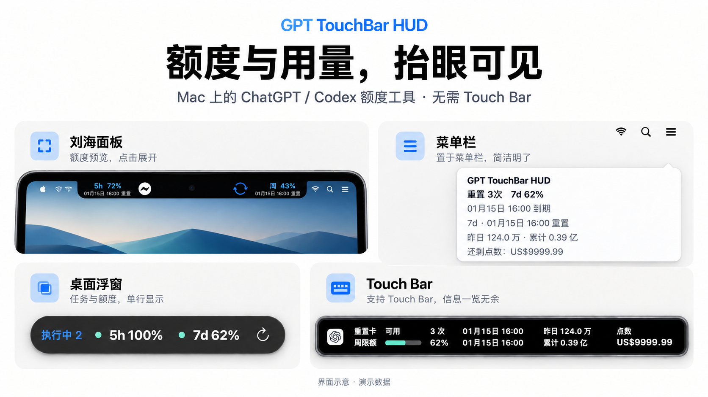
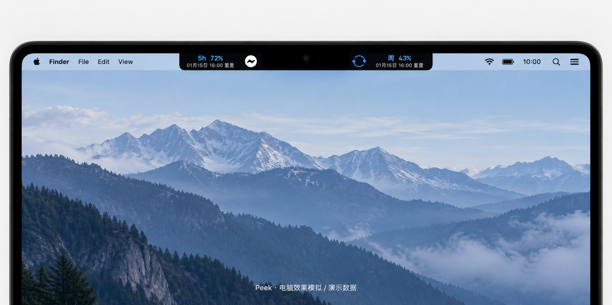
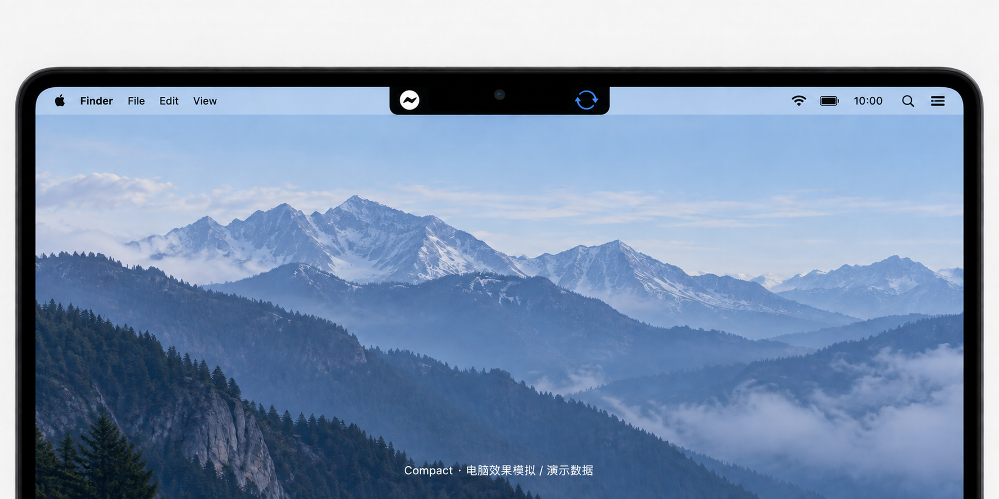
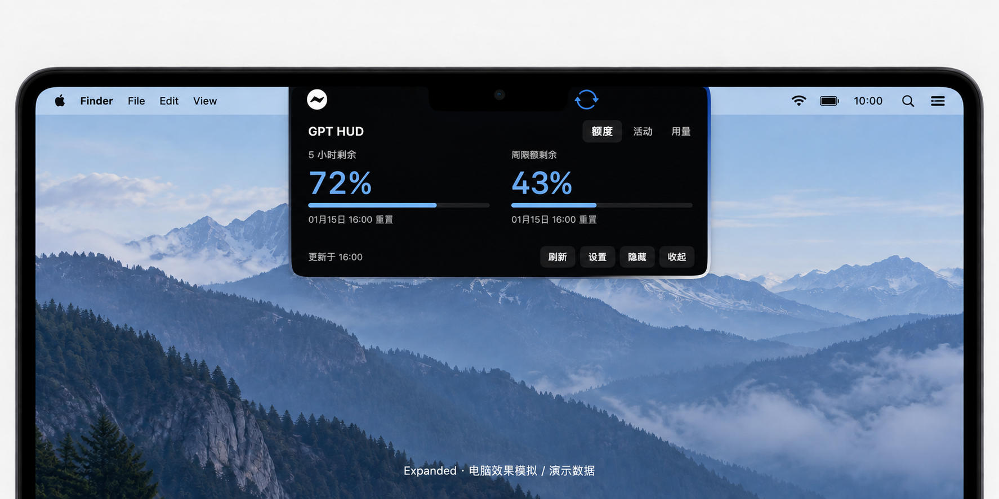
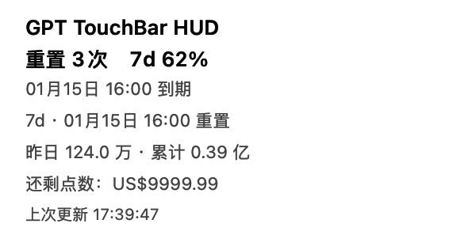
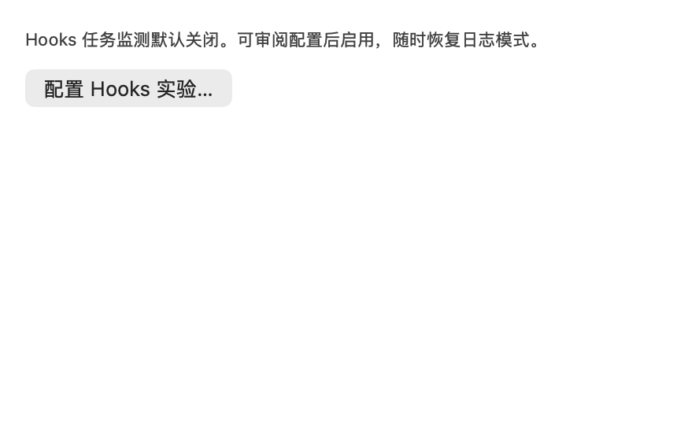

# GPT TouchBar HUD

> 主图为基于原生界面制作的展示示意，使用演示数据；刘海场景另附电脑效果模拟，具体排版与交互以原生截图和说明为准。

**[下载最新版本](https://github.com/zz-zed/GPT-TouchBar-hud/releases/latest) · [快速开始](#快速开始) · [常见问题](#常见问题) · [反馈问题](https://github.com/zz-zed/GPT-TouchBar-hud/issues)**

> 当前版本：v0.1.33 / Build 36。安装包、SHA-256 校验文件及构建清单见 [Release 页面](https://github.com/zz-zed/GPT-TouchBar-hud/releases/tag/v0.1.33)。

## 界面与使用场景

### 刘海屏：平时看额度，点击看详情

**额度预览态 Peek · 默认常驻形态**

额度和重置时间分布在刘海两侧，无需打开详情即可查看。首次使用且没有历史偏好时默认采用这一形态。右侧以两行展示周剩余额度和 `MM/dd HH:mm` 短日期，悬停可查看完整重置时间；左侧 5h 展示保持不变。

**静止态 Compact · 更简洁的常驻选择**

平时只保留两侧指示器，鼠标悬停后预览额度。在“设置 → 通用 → 刘海常驻形态”中切换，升级会保留已有选择。

**展开态 Expanded · 查看详细信息**

点击面板展开“额度 / 活动 / 用量”，也可刷新、打开设置、隐藏面板或收起详情。收起后回到选定的常驻形态，任务状态变化不会自动展开面板。

以上三图为基于原生界面制作的电脑效果模拟，使用演示数据，并非实机照片；真实布局与渲染细节可对照[使用指南中的原生截图](Documentation/USER-GUIDE.md#刘海融合面板)。

### 所有支持的 Mac：菜单栏查看完整摘要

点击菜单栏图标，查看额度、重置时间、昨日与累计 Token、点数和更新时间，并进入刷新、显示模式、设置与更新等操作。

上图展示菜单顶部的摘要区域。“菜单栏内容”支持自动、仅图标、单额度和完整额度；自动模式下，面板可见时只保留图标，面板隐藏后显示一项主要额度。

### 桌面浮窗：任务与额度保持单行可见

没有刘海，或希望使用独立浮窗时，可切换到桌面浮窗。它根据内容调整宽度，以单行展示任务状态与额度，并提供刷新按钮；颜色与透明度可在设置中调整。

无刘海屏首次使用时，浮窗默认隐藏；从菜单栏选择“显示状态面板”打开。

### Touch Bar：在键盘上方查看额度与用量

配备 Touch Bar 的 Mac 可在左侧应用区域常驻显示额度、重置时间、Token 与点数，右侧系统控制条仍保留。其他 Mac 可使用上面三种展示方式，无需 Touch Bar。

常驻模式会占用其他 App 的左侧 Touch Bar 快捷按钮区域，可在“设置 → Touch Bar”关闭。无 Touch Bar 的机型隐藏相关设置页和菜单入口；型号识别失败时保留入口。菜单摘要、浮窗和 Touch Bar 图片均为原生视图的演示数据截图。

### 实验性任务状态：查看本机任务提示

任务提示可显示执行中数量、最近完成或未知状态。Hooks 实验提供配置审阅与覆盖范围提示；状态仅作为本机 Codex 任务的辅助信息。

Hooks 默认关闭，连接正常也不代表覆盖全部任务。配置与限制见 [Hooks 实验说明](Documentation/HOOKS-EXPERIMENT.md)。更多设置见[使用指南](Documentation/USER-GUIDE.md)。

## 这是什么

**GPT TouchBar HUD 是一个 Mac 上的 ChatGPT / Codex 账号额度与用量工具，无需 Touch Bar。**

不用反复切回账户页面，就能在菜单栏、刘海面板或桌面浮窗中查看剩余额度、重置时间与用量；配备 Touch Bar 的机型还可以在键盘上方显示信息。应用在菜单栏运行，不在 Dock 常驻，也不需要一直打开主窗口。

使用前需要安装并登录受支持的本机客户端。任务提示仅针对本机 Codex 任务，不代表全部 ChatGPT 会话。

## 主要功能

| 功能 | 可以做什么 |
| --- | --- |
| 四种展示方式 | 按设备与习惯选择菜单栏、刘海融合、桌面浮窗或 Touch Bar。 |
| 额度与重置提醒 | 查看账号提供的额度窗口、重置时间与可用重置次数。 |
| Codex 重置预告 | 默认开启，查看今天及未来的公开重置安排；四种入口同步显示有效预告条数，独立于账号额度。 |
| Token 与点数 | 查看客户端返回的昨日、累计 Token 和剩余点数。 |
| 刘海两种常驻形态 | 默认 Peek 直接预览额度，也可选择 Compact，悬停后预览、点击展开详情。 |
| 外观与信息设置 | 选择菜单栏内容、信息语言，调整桌面浮窗颜色与透明度。 |
| 本机任务提示（实验性） | 查看执行中、最近完成或未知状态；可选启用 Hooks 实验。 |
| 自动检查更新 | 发现新版本时提示，确认后才下载安装，也可随时手动检查。 |
| 随客户端启动 | 与 ChatGPT / Codex 启停联动，手动退出后本轮宿主会话内不再拉起。 |

## 快速开始

### 安装前确认

- 已将 ChatGPT、Codex 或 GPT 客户端安装在系统 `/Applications` 目录，并完成登录。应用需要客户端内置的 `codex app-server` 可用。
- 安装包的最低构建目标为 **macOS 11**；实际 macOS 11 运行尚未验收，宿主客户端还可能有更高的系统要求。双架构发布 CI 通过不等于所有机型均已实测，可参考[上一正式版本的验证记录](Documentation/RELEASE-0.1.31.md)。
- 当前安装包使用 ad-hoc 签名，**尚未经过 Apple 公证**，首次打开可能出现安全提示。

安装包只按处理器选择，与是否有 Touch Bar 无关。在“ → 关于本机”查看芯片或处理器：

| 你的 Mac | 下载文件 |
| --- | --- |
| Apple 芯片 | `GPT-TouchBar-HUD-<版本号>-arm64.dmg` |
| Intel 处理器 | `GPT-TouchBar-HUD-<版本号>-x86_64.dmg` |

### 安装步骤

1. 从[最新 Release](https://github.com/zz-zed/GPT-TouchBar-hud/releases/latest) 下载对应 DMG。
2. 打开 DMG，把 `GPT TouchBar HUD.app` 拖入 `Applications`。
3. 先启动并登录 ChatGPT / Codex，再打开 `GPT TouchBar HUD.app`。
4. 如提示“无法验证开发者”，双击安装包中的 `首次打开助手.command`，输入 `OPEN` 后回车。也可先尝试打开应用，再到“系统设置 → 隐私与安全性 → 仍要打开”。

首次打开助手仅用于你信任的安装包，无需开启“任何来源”。如果系统提示恶意软件或应用损坏，请先停止，重新下载或[反馈问题](https://github.com/zz-zed/GPT-TouchBar-hud/issues)。

### 打开后，你应该看到什么

- **菜单栏有状态图标，Dock 不常驻图标。**应用没有必须一直打开的主窗口。
- **有刘海**：首次使用且没有历史设置时，显示 Peek 额度预览；点击面板展开详情。
- **没有刘海**：桌面浮窗默认隐藏，从菜单栏选择“显示状态面板”即可打开。
- **菜单栏只有图标也可能是正常的。**“菜单栏内容”为“自动”时，状态面板显示期间只留图标，面板隐藏后显示一项主要额度。
- **升级会保留已有选择。**已选择 Compact 或隐藏面板的用户，不会被强制切换为 Peek 或重新显示面板。

应用会注册当前用户的自动启动项，随 ChatGPT / Codex 启动，并在宿主完全退出后结束。通过菜单“退出”后，本轮宿主会话内不会自动重新拉起；宿主完全退出再启动后恢复联动。移除自动启动项见[卸载说明](Documentation/UNINSTALL.md)。

## 常用操作

| 你想做什么 | 去哪里操作 |
| --- | --- |
| 查看完整额度、Token 与点数 | 点击菜单栏图标，或点击刘海面板展开详情。 |
| 查看重置预告 | 点击菜单栏、Touch Bar、桌面浮窗或刘海中的重置预告入口。 |
| 检查或关闭重置预告、调整提示音 | 设置 → 重置预告；此处“检查预告”独立于“刷新额度”。 |
| 显示或隐藏当前面板 | 菜单栏 → “显示状态面板 / 隐藏状态面板”。 |
| 让刘海平时也显示额度 | 设置 → 通用 → 刘海常驻形态 → “额度预览态 Peek（默认）”。 |
| 平时只保留刘海两侧指示器 | 设置 → 通用 → 刘海常驻形态 → “静止态 Compact”。 |
| 让菜单栏一直显示额度 | 将“菜单栏内容”从“自动”改为“单额度”或“完整额度”。 |
| 改用桌面浮窗 | 设置 → 通用 → 显示模式 → “桌面浮窗”。 |
| 调整浮窗颜色与透明度 | 设置 → 外观；这些选项不改变刘海面板的黑色外观。 |
| 关闭任务状态监测 | 设置 → 通用 → 关闭“显示任务状态（实验性）”。 |
| 恢复其他 App 的 Touch Bar 按钮 | 设置 → Touch Bar → 关闭“Touch Bar 常驻”。 |
| 检查或安装新版本 | 菜单栏 → “检查更新…”或设置 → 更新。 |

自动检查更新默认开启，只提示新版本，**不会自动下载或安装**。你确认“安装并重启”后才会下载安装；可在设置中关闭自动检查。安装路径要求与失败恢复见[更新说明](Documentation/UPDATING.md)。

### 重置预告怎么看

重置预告默认开启，升级会保留已明确关闭的选择；提示音默认关闭，系统通知仍受 macOS 权限控制。只有 Codex 与 HUD App 同时运行且未休眠时才检查，Codex 退出后，即使 ChatGPT 仍运行也会停止检查。

列表只保留本地当天及未来有可确定日期的重置安排，按安排时间从近到远排序；当天已过具体时刻但来源尚未明确完成或取消的安排保留至日末。历史公告、额外重置次数赠送、已完成、已取消和已被替代的安排不再展示，旧缓存也会同步清理。无法确定安排日期时，不用发表日或发现日代替重置日。

各入口数字是**当前有效预告条数**，不是未读数，也不是账号可用重置次数。同一公告即使有多个安排也只算一条，查看详情不会减少数字。公共公告不会修改账号额度或替账号执行重置。

详情突出“预计重置日期”，例如“9月22日（周二）”。按公告中的“周二”“明天”等信息推算时会说明依据；只有来源给出明确目标时刻才显示本地几点及 UTC 偏移。日期级信息、时间窗口和旧缓存精度未知时显示“具体时刻未公布”，不会把推算出的午夜当作 00:00 重置。

打开入口或点击通知只显示本地缓存，不打开外部页面、不启动 Codex，也不触发账号额度刷新。弹框跟随入口定位，并约束在该屏幕的可用范围内；长列表可滚动查看。首次成功获取仅建立静默基线，不集中提醒历史内容。

## 能看哪些数据

| 信息 | 覆盖范围 |
| --- | --- |
| 额度、重置时间、重置次数与点数 | 按客户端接口实际返回显示，不同账号可能提供不同项目。 |
| 重置预告 | 公开公告中的当天及未来安排，不保证适用于当前账号，也不代表额度已经重置。 |
| 昨日与累计 Token | 客户端返回的账号统计，不是对当前电脑的会话日志求和。 |
| 任务状态 | 本机 Codex 任务的实验性提示，不覆盖全部网页、远程或账号任务。 |

任务状态提示**默认开启**，会有界读取本机任务索引和近期日志，可能显示执行中、最近完成或未知。它不表示整个目标已完成，也不提供准确进度百分比；关闭开关后停止任务日志读取。

Hooks 监测实验**默认关闭**。启用需要审阅配置并在宿主中正常信任；它仍使用本机索引和日志核对状态，连接正常不代表覆盖全部任务。详见[数据与隐私](Documentation/DATA-AND-PRIVACY.md)和[Hooks 实验说明](Documentation/HOOKS-EXPERIMENT.md)。

## 常见问题

打开后没有窗口，是不是没启动？

先查看菜单栏图标。应用不在 Dock 常驻，无刘海时桌面浮窗默认隐藏；点击菜单栏中的“显示状态面板”。已保存的隐藏状态会跨重启保留，再次打开正在运行的应用可进入设置。

为什么菜单栏只有图标，没有额度？

“自动”模式下，面板显示期间仅保留图标。需要常显额度时，将“菜单栏内容”改为“单额度”或“完整额度”。

为什么只有周额度，或一直显示 --？

应用只展示账号实际提供的额度窗口，只有周额度不一定是异常。`--` 表示数据缺失或暂时无法确认；先确认宿主已登录并正常运行，再使用“刷新额度”。仍无数据时，按[数据排查说明](Documentation/DATA-AND-PRIVACY.md)检查客户端与接口，不要在 Issue 中附上登录凭据或完整会话日志。

Token 后的 *、任务状态的 ? 是什么意思？

Token 后的 `*` 表示刷新失败后保留的旧数据；普通日志模式不单独提示无法确认或读取异常，没有已确认执行中任务时保持中性。Hooks 模式的未知提示可能表示接入覆盖范围不足。它们不代表零用量、零任务或任务已完成。任务状态不准确时，可以关闭实验性提示。

为什么升级到新版本后仍是 Compact？

升级保留已有偏好。曾关闭旧版“刘海始终显示额度”的用户仍使用 Compact；从未保存过这项偏好时才默认 Peek。需要更改时，到“设置 → 通用 → 刘海常驻形态”选择 Peek。

为什么选择 English 后，设置仍是中文？

信息语言仅影响额度与任务信息的文字、日期和数字单位；导航和设置保持中文。

首次打开受阻，或者想完整卸载怎么办？

首次打开按上方[安装步骤](#安装步骤)操作。卸载时需先处理自动启动项；启用过 Hooks 的用户还需清理本工具配置和 helper。删除 App 不会自动删除这些内容，具体步骤见[卸载说明](Documentation/UNINSTALL.md)。

## 隐私与联网

- 无需配置 API Key，不保存密码或访问令牌，不上传本机会话日志。账号数据通过宿主已有登录态获取；重置预告开启时读取公开公告源，自动检查更新会访问 GitHub。
- 本地会保存偏好、更新状态、自动启动标记和预告缓存；预告历史清理后仍保留有限的通知去重与防回滚记录，避免重复提醒或旧公告重新出现。启用 Hooks 或确认安装更新后还会产生相应配置、缓存或恢复材料，详见[数据与隐私](Documentation/DATA-AND-PRIVACY.md)。
- Touch Bar 常驻使用 AppKit 私有接口，可能受系统升级影响，并会占用其他 App 的左侧 Touch Bar 快捷按钮区域；需要时可关闭，右侧系统控制条仍保留。
- 实体刘海接缝、全屏、多屏和唤醒仍需真机验收；实际 macOS 11 运行与正式安装路径中的自动更新完整链路尚未完成验收。遇到刘海适配问题，可改用桌面浮窗。

## 更多文档

| 文档 | 内容 |
| --- | --- |
| [使用指南](Documentation/USER-GUIDE.md) | 菜单栏、刘海、桌面浮窗、Touch Bar 与详细设置。 |
| [数据与隐私](Documentation/DATA-AND-PRIVACY.md) | 数据来源、刷新规则、任务范围、本地存储与排查。 |
| [更新说明](Documentation/UPDATING.md) | 自动检查、安装校验、路径要求与失败恢复。 |
| [卸载说明](Documentation/UNINSTALL.md) | 自动启动项、Hooks、偏好及恢复材料的清理。 |
| [开发说明](Documentation/DEVELOPMENT.md) | 工作原理、源码构建、测试与原生预览。 |
| [Hooks 实验](Documentation/HOOKS-EXPERIMENT.md) | 配置审阅、覆盖范围与清理边界。 |
| [发布记录](https://github.com/zz-zed/GPT-TouchBar-hud/releases) | 正式安装包、变更说明与校验文件。 |

## 共享与许可证

欢迎反馈问题或提交 Pull Request，开发前请阅读[贡献指南](CONTRIBUTING.md)。反馈时说明应用与 macOS 版本、处理器和复现步骤，勿提交账号凭据或完整会话内容。

本项目遵循 [MIT License](LICENSE)。感谢 [jackchensky/TouchBarCodexToken](https://github.com/jackchensky/TouchBarCodexToken) 原项目提供的基础实现。
